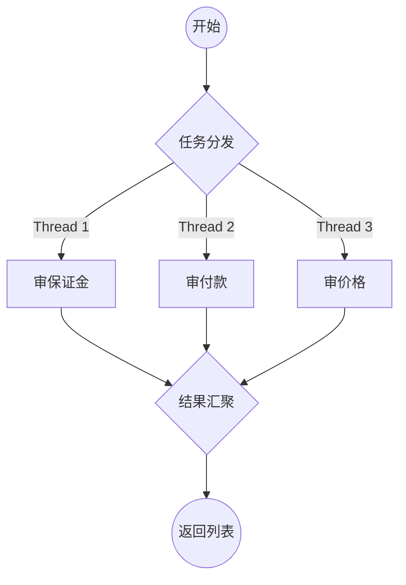

# TN-005: 双工架构设计与并发模式深度解析 (Dual Worker Architecture)

* **状态** : 已完成 (Implemented)
* **日期** : 2026-01-16
* **模块** : AI Core / Worker Layer
* **核心模式** : 流水线 (Pipeline) vs 扇出扇入 (Fan-Out/Fan-In)
* **关联代码** : `CalculationWorker`, `CommercialWorker`, `AsyncConfig`

## 1. 演进背景 (Evolution Context)

在 AgentHub v3.0 时代，所有的合规逻辑都混杂在一个 `ComplianceWorker` 中。

* **问题**：既包含“先查年份再算公式”的强依赖逻辑，又包含“多条款同时审查”的无依赖逻辑。
* **后果**：逻辑耦合，无法针对性优化性能，代码维护困难。

**v4.0 决策**：实施 **双工模式 (Dual Worker Pattern)**。根据任务的 **数据依赖性 (Data Dependency)**，将 Worker 拆分为两种截然不同的形态。

## 2. 架构对比视图 (Architecture Comparison)

我们通过物理隔离建立了两种 Worker，它们共享底层的 `agentWorkerExecutor` 线程池，但运作方式截然不同。

| 特性 | **CalculationWorker (计算专工)** | **CommercialWorker (商务专工)** |
| --- | --- | --- |
| **前身** | 原 `ComplianceWorker` | 新增组件 |
| **核心职责** | 偏差考核计算、数值提取 | 保证金、付款、价格条款审查 |
| **执行模式** | **串行流水线 (Serial Pipeline)** | **并行扇出 (Parallel Fan-Out)** |
| **为什么这么设计?** | **强依赖**：必须先知道“年份”，才能查“阈值”；有了“阈值”，才能“套公式”。 | **无依赖**：查“保证金”和查“付款周期”互不干扰，谁先谁后无所谓。 |
| **耗时公式** | $T_{total} = T_1 + T_2 + \dots + T_n$ | $T_{total} = \max(T_1, T_2, \dots, T_n)$ |

---

## 3. 模式一：串行流水线 (The Pipeline Worker)

**组件**：`CalculationWorker`
**场景**：用户输入 "计划500，实际480..."，系统需计算是否免责。

### 3.1 运行时序图 (Runtime Flow)

```mermaid
graph LR
    Start((开始)) --> Step1[Skill: 提取年份]
    Step1 --得到"2026"--> Step2[Tool: 查RAG阈值]
    Step2 --得到"3%"--> Step3[Skill: 提取数值]
    Step3 --得到"Load=500"--> Step4[Tool: 公式计算]
    Step4 --> End((返回报告))
```

*注意：箭头代表数据流动的方向，下游严格依赖上游的输出。*

### 3.2 核心代码实现

```java
// CalculationWorker.java
public DeviationReport executeDeviationCalculation(String userQuery) {
    // Step 1: 上下文锁定 (必须先做)
    String year = complianceSkills.extractYearContext(userQuery);

    // Step 2: 查据 (依赖 Step 1 的 year)
    // 必须有了年份，才能去 RAG 查当年的阈值
    PowerKnowledgeQuery ragQuery = new PowerKnowledgeQuery("免责阈值", 1, year, "BUSINESS");
    double threshold = extractThreshold(knowledgeTool.retrieve(ragQuery));

    // Step 3: 识意 (独立步骤，但通常需结合上下文)
    DeviationInput input = complianceSkills.extractDeviationParams(userQuery);

    // Step 4: 计算 (依赖 Step 2 的阈值 + Step 3 的数据)
    return formulaTool.calculate(input, threshold);
}
```

---

## 4. 模式二：并行扇出 (The Parallel Worker)

**组件**：`CommercialWorker`
**场景**：用户上传合同，系统需全量审查商务条款。

### 4.1 运行时序图 (Runtime Flow)



*注意：Split 代表同时发射，Join 代表等待所有任务归队。*

### 4.2 核心代码实现

```java
// CommercialWorker.java
public List<CommercialAuditResult> executeCommercialAudit(String content) {
    List<String> items = List.of("投标保证金", "履约保证金", "付款周期");

    // Fan-Out: 异步派发
    List<CompletableFuture<CommercialAuditResult>> futures = items.stream()
        .map(item -> CompletableFuture.supplyAsync(() -> {
            // 独立的 Skill 调用，互不依赖
            return commercialSkills.auditCommercialTerm(item, content);
        }, executor)) // 使用 agentWorkerExecutor 线程池
        .toList();

    // Fan-In: 阻塞等待
    return futures.stream()
        .map(CompletableFuture::join)
        .collect(Collectors.toList());
}
```

---

## 5. 基础设施：共享的动力源 (Shared Infrastructure)

为了支撑这两个 Worker 高效运转，我们在底座层做了统一配置。

* **舱壁隔离 (Bulkhead)**：在 `AsyncConfig` 中注册了 `@Bean("agentWorkerExecutor")`。
* **资源复用**：
  * `CalculationWorker` 虽然是串行，但也运行在这个线程池中（避免阻塞主线程）。
  * `CommercialWorker` 利用这个线程池的 `CorePoolSize=10` 能力实现并发。

## 6. 总结与最佳实践 (Summary)

在设计新的 Worker 时，请遵循 **“依赖判定法”**：

1. **问自己**：步骤 B 的输入是否依赖步骤 A 的输出？
2. **如果是** $\rightarrow$ 使用 **CalculationWorker 模式 (串行)**。不要强行并发，否则会因为数据缺失导致空指针或逻辑错误。
3. **如果否** $\rightarrow$ 使用 **CommercialWorker 模式 (并行)**。充分利用多线程优势，压缩总耗时。

**架构师备注**：
这份文档完整记录了 v4.0 的双工架构。它告诉我们：**架构没有绝对的“快”，只有逻辑上的“对”。** 适合串行的坚决串行，适合并行的坚决并行。这才是成熟系统的标志。
