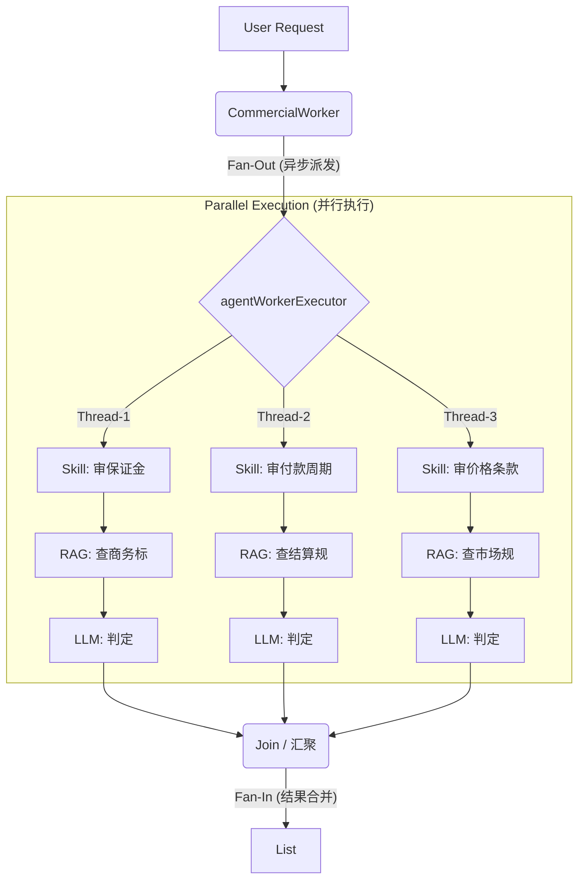

# TN-005: 并行工作者模式深度解析 (Parallel Worker Implementation)

* **状态** : 已完成 (Implemented)
* **日期** : 2026-01-16
* **模块** : AI Core / Worker Layer
* **涉及组件** : `CommercialWorker`, `AsyncConfig`, `CompletableFuture`
* **核心模式** : 扇出/扇入 (Fan-Out/Fan-In), 舱壁隔离 (Bulkhead)

## 1. 核心痛点与解决方案

在合规审查场景中，我们需要对一份标书进行多项检查（如：保证金、付款周期、违约责任、价格条款）。

* **传统模式 (Serial)**:
  * 先查保证金 (5s) -> 再查付款 (5s) -> 再查价格 (5s)。
  * **总耗时**: 15s。用户体验极差。

* **并行模式 (Parallel)**:
  * 同时查保证金、付款、价格。
  * **总耗时**: $\max(5s, 5s, 5s) \approx 5s$。效率提升 300%。

**架构决策**：在 `CommercialWorker` 中引入基于 `CompletableFuture` 的并行编排机制，并配合独立的线程池实现资源隔离。

## 2. 架构原理图解 (Architecture Diagram)

我们采用了 **Scatter-Gather (分散-聚集)** 模式：



## 3. 实现三部曲 (Implementation Steps)

### 3.1 基础设施：舱壁隔离 (The Engine)

为了防止 AI 任务阻塞 CPU 密集型任务（如文件解析），我们在 `AsyncConfig` 中定义了专用线程池。

* **代码位置**: `com.agenthub.api.framework.config.AsyncConfig`
* **关键配置**:
  * `CorePoolSize = 10`: 保证至少有 10 个并发槽位专门服务于 AI 请求。
  * `CallerRunsPolicy`: 队列满时由主线程执行，确保不丢单。

### 3.2 业务逻辑：异步编排 (The Orchestration)

* **代码位置**: `com.agenthub.api.ai.worker.CommercialWorker`
* **核心机制**:
  1. **注入线程池**: 使用 `@Qualifier("agentWorkerExecutor")` 获取动力源。
  2. **供应链 (SupplyAsync)**: 将每个 Skill 的调用包装成一个 `CompletableFuture`。
  3. **异常兜底 (Exceptionally)**: 确保单个线程崩溃（如网络超时）不会导致整个任务失败，而是返回一个“未知”状态的结果。

### 3.3 技能服务：无状态调用 (The Skill)

* **代码位置**: `com.agenthub.api.ai.service.skill.CommercialSkills`
* **关键点**: `ChatClient` 和 `PowerKnowledgeService` 都是线程安全的。多个线程同时调用 `auditCommercialTerm` 方法时，它们在各自的栈内存中运行，互不干扰。

## 4. 运行时流程实例 (Runtime Scenario)

假设用户上传了一份合同，内容包含：“投标保证金 100万，D+5日付款”。

**时间轴演示 (Timeline)**:

* **T=0.0s**: `CommercialWorker` 收到请求。定义审查清单：`["投标保证金", "付款周期"]`。
* **T=0.1s**: 主线程向 `agentWorkerExecutor` 提交 2 个任务。
  * **任务 A (线程 agent-1)**: 开始审查“投标保证金”。
  * **任务 B (线程 agent-2)**: 开始审查“付款周期”。
  * *主线程*: 立即释放，等待 (Non-blocking wait)。

* **T=0.2s**:
  * *线程 agent-1*: 调用 `PowerKnowledgeService`，搜索 "投标保证金 规定" (Category=BUSINESS)。
  * *线程 agent-2*: 调用 `PowerKnowledgeService`，搜索 "付款周期 规定" (Category=BUSINESS)。

* **T=0.5s**: RAG 检索完成。
  * *线程 agent-1*: 拿到《2026交易规则》第10页。
  * *线程 agent-2*: 拿到《结算实施细则》第5页。

* **T=0.6s**:
  * *线程 agent-1*: 调用 LLM (Qwen)，Prompt: "规则说上限80万，用户写100万，合规吗？"
  * *线程 agent-2*: 调用 LLM (Qwen)，Prompt: "规则说D+2，用户写D+5，合规吗？"

* **T=3.5s**: LLM 响应。
  * *线程 agent-1*: 返回 `passed=false, issue="超限"`。
  * *线程 agent-2*: 返回 `passed=false, issue="拖延支付"`。

* **T=3.6s**: `CompletableFuture.join()` 触发。主线程收集到 2 个结果。
* **T=3.7s**: 返回最终 JSON 给前端。

**结果**: 用户只等待了 **3.7秒**，而不是串行执行所需的 **7秒+**。

## 5. 核心代码复盘 (Code Review)

```java
// CommercialWorker.java

public List<CommercialAuditResult> executeCommercialAudit(String content) {
    // 1. 定义并发源 (Source)
    List<String> items = List.of("投标保证金", "履约保证金", "付款周期");

    // 2. 扇出 (Fan-Out)
    List<CompletableFuture<CommercialAuditResult>> futures = items.stream()
        .map(item -> CompletableFuture.supplyAsync(() -> {
            // 2.1 具体的业务动作 (运行在 agent-worker 线程中)
            return commercialSkills.auditCommercialTerm(item, content);
        }, executor)) // <--- 关键：指定专用线程池
        .toList();

    // 3. 扇入 (Fan-In)
    return futures.stream()
        .map(CompletableFuture::join) // 阻塞等待所有线程归队
        .collect(Collectors.toList());
}
```

## 6. 总结 (Summary)

* **并行不是魔法**: 它依赖于底层的线程池配置 (`AsyncConfig`) 和 业务的无状态设计 (`CommercialSkills`)。
* **隔离至关重要**: 独立的 `agentWorkerExecutor` 保证了即使 AI 响应变慢，也不会拖垮系统的文件上传功能。
* **扩展性**: 未来如果增加了 "违约责任"、"不可抗力" 等新检查项，只需在 `items` 列表里加一行，总耗时 **几乎不会增加**。

---

**架构师备注**:
这个文档现在已经完全把“并行 Worker”的黑盒打开了。你可以把它放进你的知识库，以后任何涉及到“提高 AI 响应速度”的场景，都可以直接引用这个 **Scatter-Gather** 模式。
