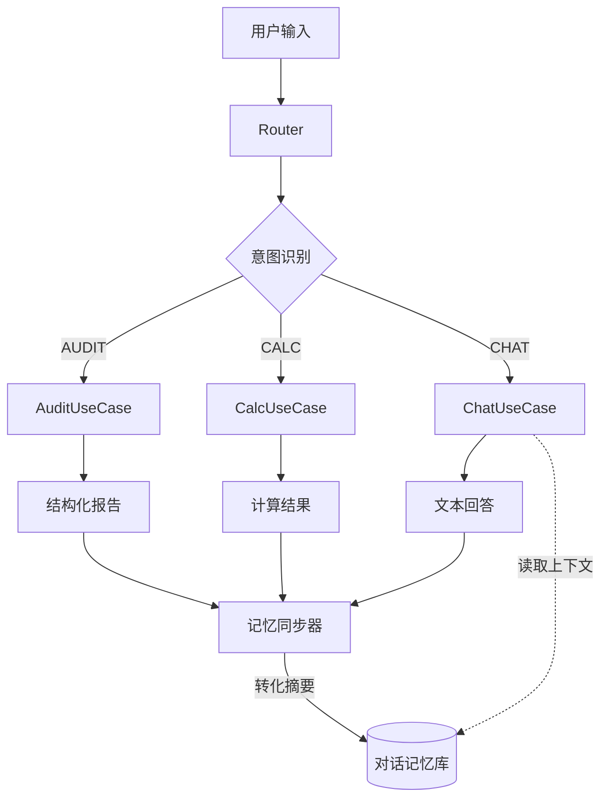

# TN-006: 上下文记忆断层与统一记忆架构 (Context Memory Architecture)

* **状态** : 规划中 (Planning)
* **日期** : 2026-01-17
* **模块** : AI Core / Memory
* **核心问题** : 跨意图 (Cross-Intent) 上下文丢失，导致多轮对话体验割裂。

## 1. 核心痛点 (The Blind Spot)

当前架构采用 **UseCase 策略模式** 分离了不同业务场景，虽然实现了代码解耦，但也导致了**记忆隔离**。

### 1.1 场景复现

*   **Round 1 (AUDIT 模式)**:
    *   **用户**: "帮我审一下这份合同。"
    *   **系统**: 调用 `AuditUseCase` -> `ComplianceWorkflowService`。
    *   **输出**: 返回一份详细的结构化 JSON 报告（含风险点：保证金超标）。
    *   **问题**: 这份报告**直接返回给了前端**，并没有存入后台的 `ChatMemory`。
*   **Round 2 (CHAT 模式)**:
    *   **用户**: "那你觉得这个保证金风险大吗？"
    *   **系统**: 识别为 `CHAT` 意图 -> 调用 `ChatUseCase`。
    *   **ChatUseCase**: 去读 `ChatMemory`，发现是空的（或者是很久以前的闲聊记录）。
    *   **AI 回复**: "抱歉，我不知道您指的‘这个保证金’是什么。"

### 1.2 根本原因

*   **Audit/Calc UseCase** 是“无状态”的工具人，干完活就走，没有由于副作用（Side Effect）去写记忆。
*   **ChatUseCase** 虽然有记忆能力，但它读取不到其他 UseCase 产生的数据。
*   **RouterService** 目前只负责分发，没有负责“统一归档”。

---

## 2. 解决方案：统一记忆切面 (Unified Memory Aspect)

为了打通上下文，必须建立一个**全局记忆写入机制**。无论用户意图是什么，交互的结果都必须以某种形式沉淀到 `ChatMemory` 中。

### 2.1 架构调整图解

### 2.2 关键实施步骤

1.  **Router 层拦截 (The Interceptor)**:
    *   在 `RouterService` 返回结果之前，统一截获 `userQuery` 和 `executionResult`。
2.  **结果摘要化 (The Summarizer)**:
    *   **AUDIT 结果**: 不能存几千字的 JSON。需转化为摘要：*"系统完成了合同审查，发现3个风险：1.保证金... 2.付款..."*。
    *   **CALC 结果**: 转化为 *"系统计算得出偏差考核费用为 1500 元"*。
    *   **CHAT 结果**: 直接存文本。
3.  **写入记忆 (The Writer)**:
    *   调用 `ChatMemoryRepository.save()`。

---

## 3. 下一步行动计划

1.  **改造 `ChatUseCase`**:
    *   确保它在构建 `ChatClient` 时，能够正确加载共享的 `sessionId` 对应的记忆。
    *   (已完成，待验证)

2.  **改造 `RouterService` (核心任务)**:
    *   引入 `ChatMemoryRepository`。
    *   在 `handleRequest` 的 `finally` 块或后置逻辑中，添加 `saveToMemory(userId, query, result)` 逻辑。
    *   编写一个简单的 `ResultSummarizer` 工具，把复杂的对象转成 AI 能看懂的短文本。

3.  **验证**:
    *   先跑 AUDIT，再问 CHAT，看 AI 能否接得上话。

---

**架构师备注**:
这个改动虽然不大，但对用户体验是质的飞跃。它让 Agent 从“一系列独立的工具”进化为了“一个连贯的智能体”。
